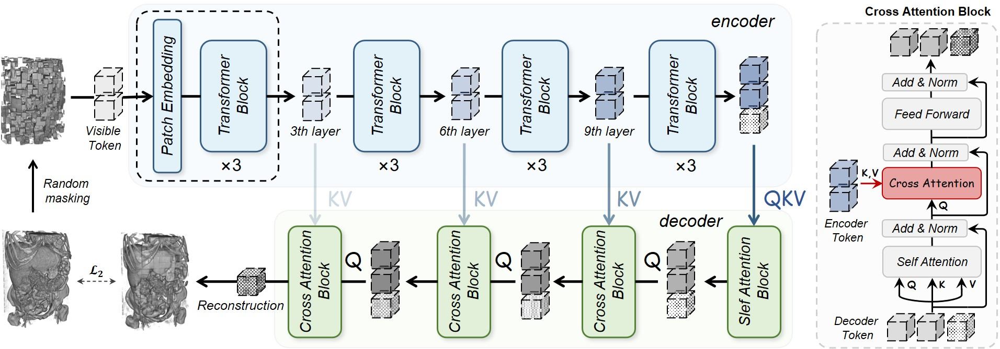
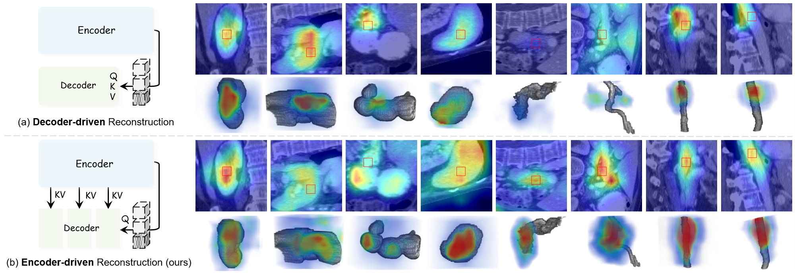

# Hi-End-MAE: Hierarchical encoder-driven masked autoencoders are stronger vision learners for medical image segmentation

<p align="center" width="100%">
<!---->
</p> 





<div align="center">
    <span class="author-block">
    <a href="https://scholar.google.com/citations?user=x1pODsMAAAAJ&hl=en" target="_blank">Fenghe Tang</a><sup>1,2</sup>,</span>
    <span class="author-block">
    <a target="_blank">Qingsong Yao</a><sup>3</sup>,</span>
    <span class="author-block">
    <a target="_blank">Wenxin Ma</a><sup>1,2</sup>,</span>
    <span class="author-block">
    <a target="_blank">Chenxu Wu</a><sup>1,2</sup>,</span>
    <span class="author-block">
    <a href="https://scholar.google.com/citations?user=Wo8tMSMAAAAJ&hl=en" target="_blank">Zihang Jiang</a><sup>1,2</sup>,</span>
    <span class="author-block">
    <a href="https://scholar.google.com/citations?user=8eNm2GMAAAAJ&hl=en" target="_blank">S.Kevin Zhou</a><sup>1,2</sup>
    </span>
</div>

<br>

<div align="center">
    <sup>1</sup>
    <a href='https://en.ustc.edu.cn/' target='_blank'>School of Biomedical Engineering, University of Science and Technology of China</a>&emsp;
    <br>
    <sup>2</sup> <a href='http://english.ict.cas.cn/' target='_blank'>Suzhou Institute for Advanced Research, University of Science and Technology of China</a>&emsp;
    <br>
    <sup>3</sup> <a href='https://www.stanford.edu/' target='_blank'>Stanford University, Palo Alto, California, 94305, United State</a>
    <br>
</div>

<br>
<br>

​                                                                              [](https://arxiv.org/pdf/2502.08347.pdf)   [](https://github.com/FengheTan9/Hi-End-MAE)    <a href="#LICENSE--citation"></a>


# News
- **[2024/08] Hi-End-MAE accepted by Medical Image Analysis (MedIA'25) ! 🥰**
- **[2024/02] Paper and code released !**


## Getting Started

### Prepare Environment

```
conda create -n HiEndMAE python=3.9
conda activate HiEndMAE
pip install torch==1.13.0 torchvision==0.14.0 torchaudio==0.13.0
pip install packaging timm==0.5.4
pip install transformers==4.34.1 typed-argument-parser
pip install numpy==1.21.2 opencv-python==4.5.5.64 opencv-python-headless==4.5.5.64
pip install 'monai[all]'
pip install monai==1.2.0
```

### Prepare Datasets

We recommend you to convert the dataset into the nnUNet format.

```
└── Hi-End-MAE
    ├── data
        ├── Dataset001_BTCV
            └── imagesTr
                ├── xxx_0000.nii.gz
                ├── ...
        ├── Dataset006_FLARE2022
            └── imagesTr
                ├── xxx_0000.nii.gz
                ├── ...
        └── Other_dataset
            └── imagesTr
                ├── xxx_0000.nii.gz
                ├── ...
```


## Start Training

Run training on multi-GPU :

```sh
# An example of training on 4 GPUs with DDP
torchrun --nproc_per_node=4 --nnodes=1 --node_rank=0 --master_addr=localhost --master_port=12351 main.py
```


## Fine-tuning

Load pre-training weights :

```python
# An example of Fine-tuning on BTCV (num_classes=14)
from downstream.factory import load_hi_end_mae_10k

model = load_hi_end_mae_10k(n_classes=14)
```





## Citation

If the code, paper and weights help your research, please cite:

```
@article{tang2025hi,
  title={Hi-End-MAE: Hierarchical encoder-driven masked autoencoders are stronger vision learners for medical image segmentation},
  author={Tang, Fenghe and Yao, Qingsong and Ma, Wenxin and Wu, Chenxu and Jiang, Zihang and Zhou, S Kevin},
  journal={arXiv preprint arXiv:2502.08347},
  year={2025}
}
```


## License

This project is released under the Apache 2.0 license. Please see the [LICENSE](LICENSE) file for more information.
